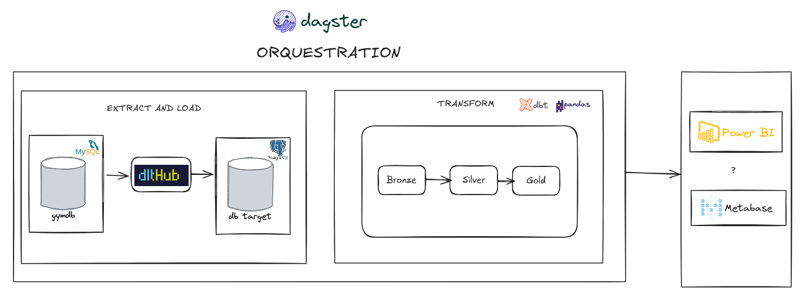

# 1. Contexto de negocio

El gimnasio cuenta con **dos sucursales**, llamadas **Max-Gym** y **Extrem-Gym**, que ofrecen una amplia variedad de servicios de actividad física, incluyendo **musculación, boxeo, kickboxing, zumba y aero step**. Además, el negocio se dedica a la **venta de productos complementarios**, como **proteínas, bebidas energéticas y ropa deportiva**. En conjunto, ambas sucursales atienden aproximadamente **10.000 clientes activos y pasivos**, generando un flujo constante de información sobre asistencia, consumo y compras.

Sin embargo, el gimnasio enfrenta varios desafíos importantes:

- **Abandono de clientes:** muchos socios dejan de asistir, y no existe un sistema claro para identificar patrones de abandono o anticipar riesgos.
    
- **Gestión de productos:** no hay información confiable sobre qué productos se venden más, cuáles se vencen y cómo optimizar el stock para maximizar ventas y reducir pérdidas.
    
- **Falta de insights estratégicos:** el negocio carece de indicadores que permitan tomar decisiones informadas sobre clientes, servicios y productos.

Este contexto motivó la necesidad de desarrollar un **pipeline de datos** que permita **centralizar, limpiar y analizar la información**, facilitando la **toma de decisiones estratégicas** tanto para mejorar la retención de clientes como para optimizar la venta de productos y servicios.
# 2. Objetivo del Proyecto

**Objetivo General:**

- Implementar un pipeline de datos para **centralizar, transformar y analizar la información del gimnasio**, con el fin de **mejorar la retención de clientes y optimizar la venta de productos y servicios**.

**Objetivos Específicos:**

1. **Identificar patrones de abandono de clientes** para anticipar bajas y diseñar estrategias de retención.
    
2. **Analizar el desempeño de productos y servicios**, detectando cuáles se venden más, cuáles se vencen y cómo optimizar el stock.
    
3. **Generar indicadores y dashboards accionables** que faciliten la toma de decisiones estratégicas para las sucursales Max-Gym y Extrem-Gym.
    
4. **Preparar la base de datos** para integrar en el futuro modelos predictivos de comportamiento de clientes y consumo de productos.

# 3. Descripción de los Datos

El gimnasio de estudio posee una base de datos relacional centralizada gestionada por el motor **mariadb** que posee **43 tablas**. Sin embargo,  dicha base de datos no fue diseñada de  con principios adecuados de normalización, Por lo tanto no hay relaciones explicitas en ninguna de las tablas, en consecuencia se invierto mucho tiempo en descubrirlas y en reuniones con el dueño del negocio para comprender el significado de cada tablas, sus columnas, y las relaciones lógicas implícitas entre ellas.

# Arquitectura de Pipeline

